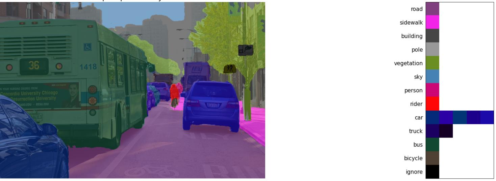
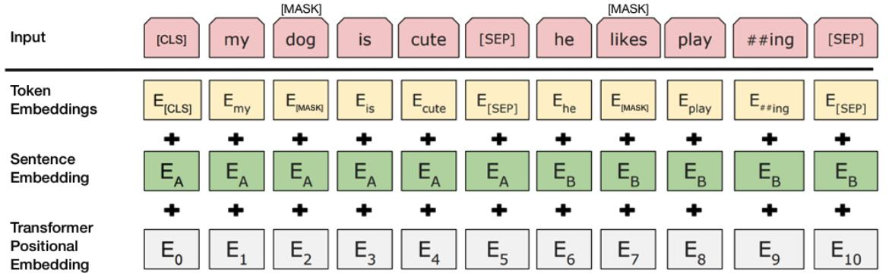
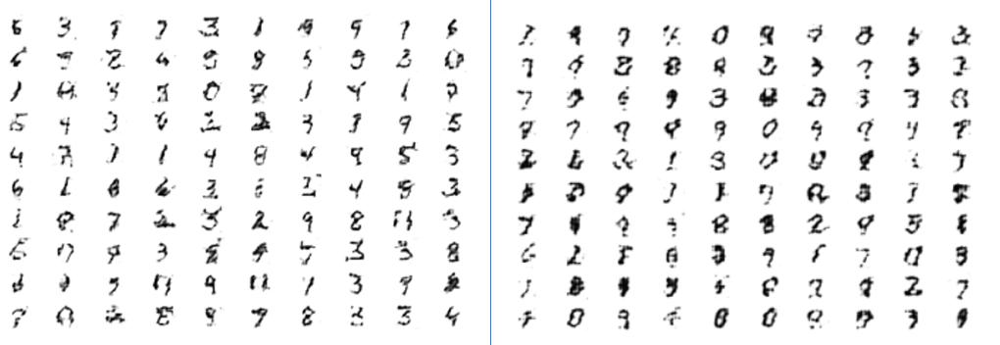

# University of Tehran - Neural Networks and Deep Learning Course

This repository contains my solutions to the **projects** from the course **"Neural Networks and Deep Learning"** at the **University of Tehran**, taken in **Winter 2022**.

The course covers a wide range of topics, including fundamental concepts of artificial neural networks, advanced deep learning architectures, and practical applications.

---

## 📚 Course Topics

### 1. Introduction to Neural Networks
- Natural Neural Networks
- Artificial Neural Networks (ANNs) and Applications  
- Network Architectures, Activation Functions, and Learning Strategies  
- McCulloch & Pitts Neuron Model

### 2. Classification and Regression Neural Networks
- Linear Perceptron  
- Adaptive Linear Neurons (AdaLine) and Multiple Adaptive Linear Neurons (MadaLine)  
- Multi-Layer Perceptron (MLP)  
- Autoencoders  
- Restricted Boltzmann Machines (RBM)  
- Deep Belief Networks (DBN)  
- Convolutional Neural Networks (CNNs)  
- Advancements and Applications of CNNs  

<p align="center">
  
</p>

### 3. Memory-Based Neural Networks  
- Auto-Associative Networks  
- Hetero-Associative Networks  
- Iterative Auto-Associative Networks  
- Hopfield Networks  
- Bidirectional Associative Memory (BAM)  
- Recurrent Neural Networks (RNNs)  
- Long Short-Term Memory (LSTM) Networks  
- Gated Recurrent Units (GRU)  
- Developments and Applications of RNNs, LSTMs, and GRUs  

<p align="center">
  
</p>

### 4. Competitive Learning Neural Networks
- MaxNet, Mexican-Hat, and Hamming Networks  
- Self-Organizing Maps (SOM)  
- Generative Adversarial Networks (GANs)  
- Advancements and Applications of GANs  


<p align="center">
  
</p>

---

## 📖 References

1. **"Fundamentals of Neural Networks"** by Laurene Fausett, 1994.  
2. **"Deep Learning"** - An MIT Press book by Ian Goodfellow, Yoshua Bengio, and Aaron Courville, 2016.  
3. **Convolutional Neural Network (UFLDL Tutorial)** - Available online:  
   [UFLDL Tutorial](http://ufldl.stanford.edu/tutorial/supervised/ConvolutionalNeuralNetwork/)  
4. **Convolutional Neural Networks (LeNet Tutorial)** - Available online:  
   [LeNet Tutorial](http://deeplearning.net/tutorial/lenet.html)  

---

## Getting Started

To explore the materials:

1. Clone the repository:
   ```bash
   git clone https://github.com/mahdichalaki/UT_NNDL.git
2. Navigate to the desired project or homework directory.
3. Open the Jupyter Notebook or Python script to run the experiments.

---

🔧 Technologies Used
- Programming Languages: Python, MATLAB
- Libraries: TensorFlow, Keras, PyTorch, NumPy, SciPy, OpenCV
- Frameworks: Scikit-learn, Matplotlib


